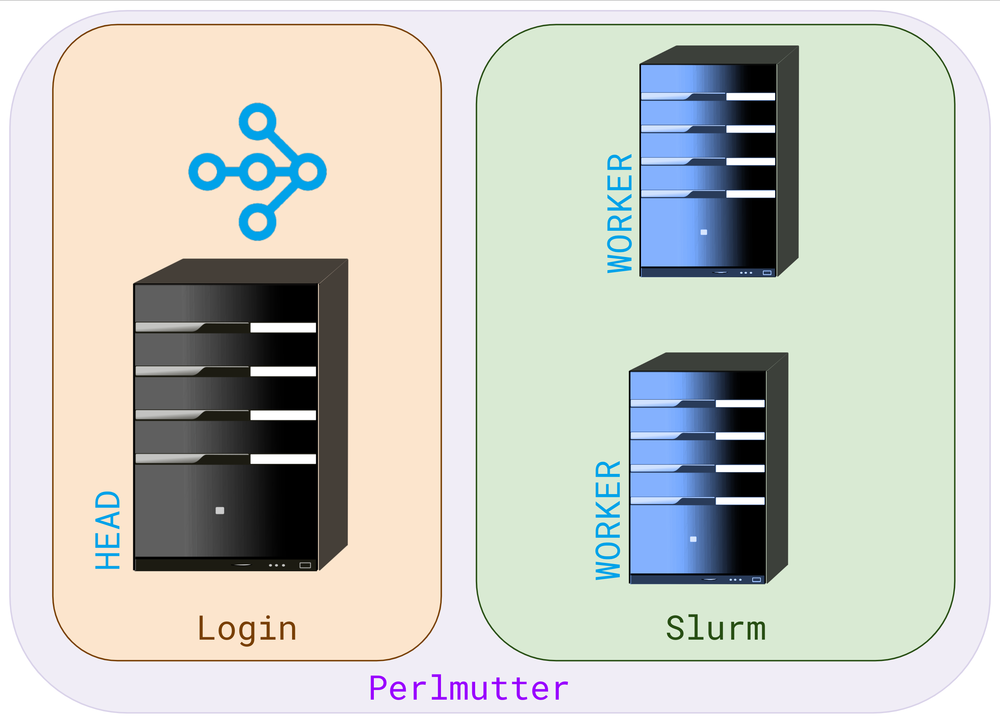
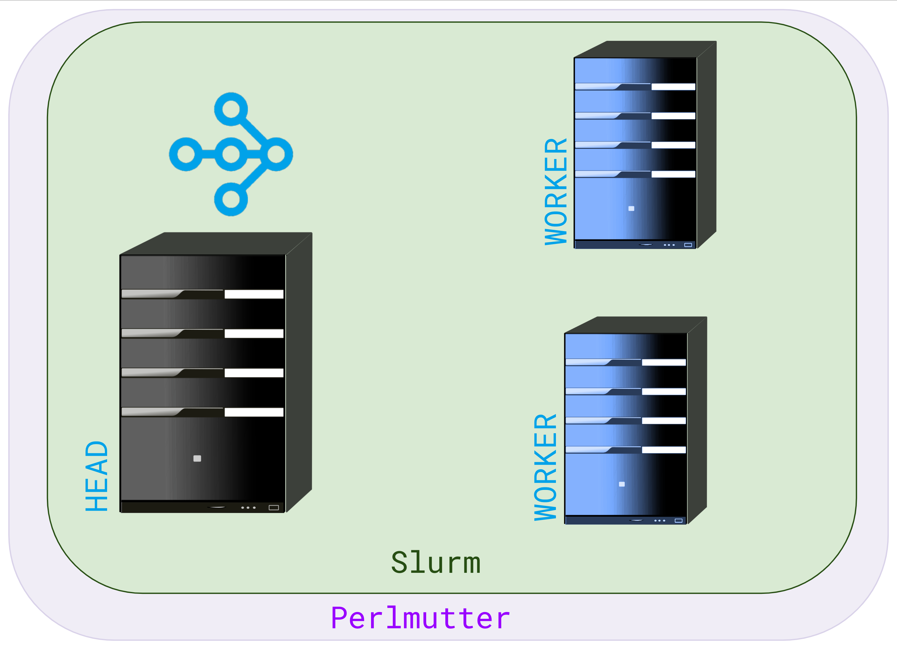

# NERSC Cluster Deploy Documentation

## Table of Contents

- [Installation](#installation)
- [Deployment modes](#deployment-modes)
- [Dashboard](#dashboard)
- [Debugging](#debugging)
- [Containers](#containers)


## Installation

To install the latest version of the library:

    pip install git+https://github.com/asnaylor/nersc_cluster_deploy.git@v0.4.0


## Deployment modes

NERSC cluster deploy supports two different deployment modes. Mode 1 (recommended for most users) creates a slurm job and Mode 2 works within a prexisting slurm job. For both cases use the [`deploy_ray_cluster`](../src/nersc_cluster_deploy/deploy.py#L25) function to create the Ray cluster. NERSC cluster deployment work in Jupyter notebooks, python scripts and interactive python.

### Mode 1: Job creation

Mode 1 works via creating the Ray head process on the local system (i.e. a login node) and then creates the Ray workers in a slurm job.



```python
from nersc_cluster_deploy import deploy_ray_cluster

#Create Ray Cluster with dashboard
rayCluster = deploy_ray_cluster(
    slurm_options = '-q regular -A elvis -t 01:00:00 -N 3' #dictionaries are also supported. Long and short slurm option supported.
    job_setup = 'module load pytorch', #lists are also supported
)
>>> Ray cluster running at x.x.x.x:6379 
>>> Dashboard avaliable at https://jupyter.nersc.gov/user/elivs/proxy/localhost:8265/ with metrics

#Connect to cluster
import ray
ray.init(address='auto')
```


### Mode 2: Within Job

Mode 2 creates both the Ray head process and workers within the slurm job. For mode 2 you do not require to specifiy any `slurm_options`.



```python
from nersc_cluster_deploy import deploy_ray_cluster

#Create Ray Cluster with dashboard
rayCluster = deploy_ray_cluster(
    job_setup = ['module load python', 'conda activate myenv'],
)
>>> Ray cluster running at x.x.x.x:6379 
>>> Dashboard avaliable at https://jupyter.nersc.gov/user/elivs/proxy/localhost:8265/ with metrics

#Connect to cluster
import ray
ray.init(address='auto')
```


## Dashboard

By default NERSC cluster deploy runs both the Granfana and Ray dashboards. If operating on the NERSC jupyterhub platform no additional settings are required. 


## Debugging

To turn on logging, use the following code:

```python
from nersc_cluster_deploy import setup_logger
import logging 
logger = setup_logger(logging.DEBUG)
```

This will show relevant information on screen but also save information from all services to log files.


## Containers

In the libraries current state it only supports Python kernels running on bare metal and not containers. In the future this support will be added.
